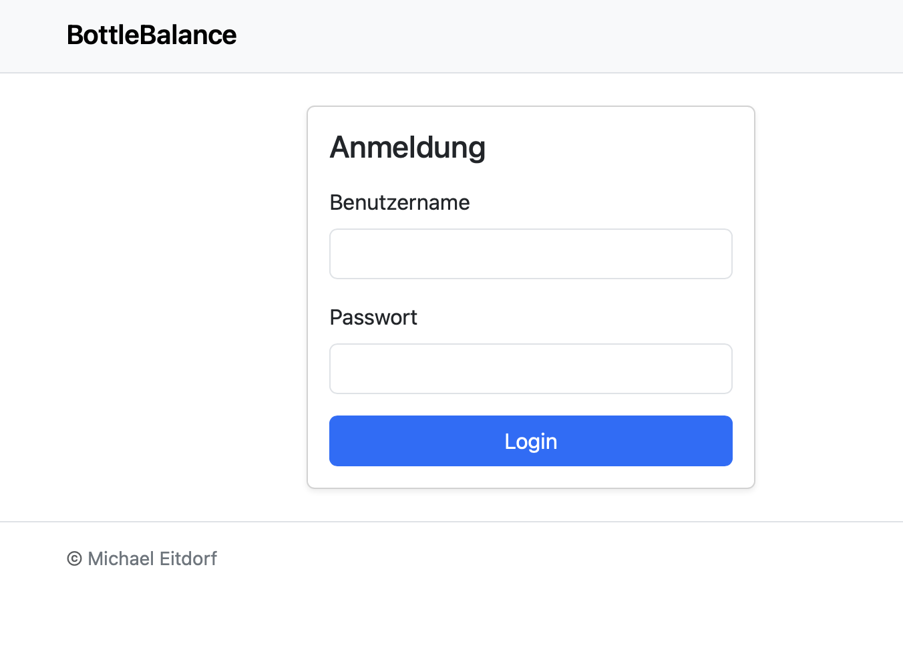
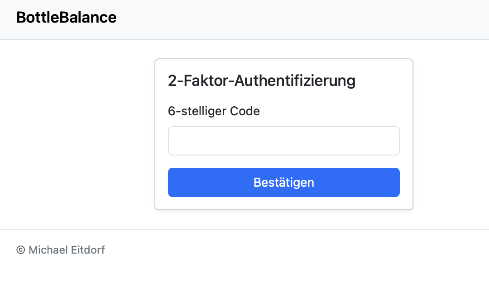
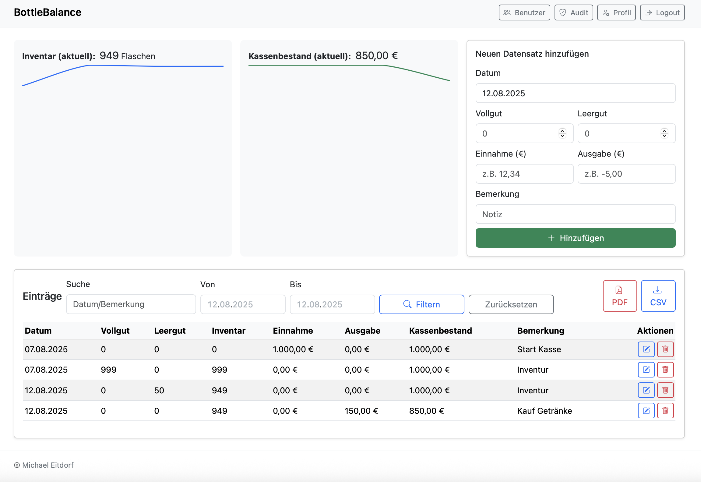

<!-- GitHub-optimized README for BottleBalance -->

<div align="center">

# BottleBalance

[](https://github.com/OWNER/REPO/actions)


A secure, lightweight web app to manage a shared cash box (e.g., beverages) — built with **Flask**, **PostgreSQL**, and **Docker Compose**.

</div>

> **DE (Kurz):** BottleBalance ist eine schlanke, sichere Web‑App zur Verwaltung einer Gemeinschaftskasse. Features: **RBAC**, **2FA (TOTP)**, **Audit‑Logs**, **CSV/PDF‑Export** und **Docker‑Deployment**. Eine vollständige deutsche Beschreibung findest du weiter unten.

---

## Table of Contents

- [Screenshots](#screenshots)
- [Features](#features)
- [Tech Stack](#tech-stack)
- [Quick Start (Docker Compose)](#quick-start-docker-compose)
- [Configuration (.env)](#configuration-env)
- [Deployment](#deployment)
- [Security Notes](#security-notes)
- [Planned](#planned)
- [License](#license)
- [Contributing](#contributing)
- [Deutsch · Ausführliche Beschreibung](#deutsch--ausführliche-beschreibung)

---

## Screenshots

<p align="center">
  
</p>
<p align="center">
  
</p>
<p align="center">
  
</p>

---

## Features

- **User & Role Management (RBAC):** Fine‑grained permissions for admins, cashiers, and regular users.
- **Two‑Factor Authentication (2FA, TOTP):** App‑based codes (RFC 6238) using `pyotp`.
- **Backup Codes for 2FA:** Generated on activation and shown in the user profile; usable during login when the authenticator is unavailable.
- **Audit Logs:** Tamper‑evident logging of critical actions (logins, settings, transactions).
- **Transactions & Balances:** Deposits/withdrawals, categories, and notes.
- **Exports:** **CSV** and **PDF** for reconciliation and reporting.
- **Email Notifications:** SMTP‑backed (e.g., confirmations or admin notices).
- **CI/CD via GitHub Actions:** Ready for automated tests and container builds.

## Tech Stack

- **Backend:** Python **Flask** with **Jinja2** templates
- **Database:** **PostgreSQL**
- **Security:** **pyotp** (TOTP 2FA), server-side sessions, CSRF protection
- **Containers:** **Docker** & **Docker Compose**

## Quick Start (Docker Compose)

1. Create a `.env` file in the project root (see [Configuration](#configuration-env)).
2. Build & start services:

```bash
docker compose -f "docker-compose.yml" up -d --build
```

3. Open the app: `http://localhost:5000`

4. Create the first **admin** account via the app, or provision via the database if self‑registration is disabled.

## Configuration (.env)

```env
SECRET_KEY=your-secret-key
DB_HOST=db
DB_NAME=bottlebalance
DB_USER=db-user
DB_PASS=db-password
SMTP_HOST=smtp.example.com
SMTP_PORT=587
SMTP_USER=mailer@example.com
SMTP_PASS=your-smtp-password
SMTP_TLS=true
FROM_EMAIL=mailer@example.com
APP_BASE_URL=http://localhost:5000
```

## Deployment

- **Reverse Proxy & TLS:** Route traffic via Nginx/Caddy to the app container; enable HTTPS (e.g., Let's Encrypt).
- **Database & Backups:** Persist PostgreSQL volumes and take regular dumps (`pg_dump`).
- **Monitoring & Logs:** Centralize container logs (e.g., Loki/ELK); review audit logs periodically.
- **Updates:** Build/pull a new image, then `docker compose up -d` for a seamless rollout.

## Security Notes

- Enforce **2FA** for all admin accounts.
- Use strong passwords and keep `SECRET_KEY` secret.
- Apply the **Principle of Least Privilege** to containers and DB users.
- Regularly update base images and Python dependencies.

## Planned


- **Deletion of User:** Possibility to soft and hard delete Users
- **Better Sparklines:** 
- **Better Sparklines:** 
- **Multilanguage support:** 
- **Financial approval formular:**
- **Docker image:** 


## License

This project is licensed under the **GNU General Public License v3.0 (GPL‑3.0)**. See **./LICENSE** for the full, legally binding text.

> **Deutsch (Kurz):** Dieses Projekt steht unter der **GNU GPL v3**. Jede Weitergabe und jedes abgeleitete Werk müssen **ebenfalls unter GPL v3** veröffentlicht werden. Eine **deutsche Übersetzung** findest du in **./LICENSE_DE.md** (nur zu Informationszwecken; rechtlich bindend ist das englische Original in `LICENSE`).

## Contributing

Contributions are welcome! Please open an issue/PR. For larger changes, discuss your proposal first.

---

## Deutsch · Ausführliche Beschreibung

**Überblick:** BottleBalance unterstützt Teams und Vereine bei der transparenten Verwaltung von Einzahlungen, Auszahlungen und Beständen. Fokus auf **Sicherheit** (RBAC, 2FA, Audit‑Logs), **Nachvollziehbarkeit** (Exports) und **einfache Bereitstellung** (Docker Compose).

**Funktionen:**
- RBAC‑Rollen (Admin/Kassenführung/Nutzer)
- 2FA (TOTP, `pyotp`) — _Backup‑Codes enthalten
- Audit‑Logs für sicherheitsrelevante Ereignisse
- CSV/PDF‑Export
- SMTP‑Benachrichtigungen

**Schnellstart:** `.env` erstellen → `docker compose -f "docker-compose.yml" up -d --build` → App unter `http://localhost:5000` öffnen.

**Betrieb & Sicherheit:** Reverse Proxy mit TLS, regelmäßige DB‑Backups, Log‑Monitoring, Updates per Compose, 2FA für Admins verpflichtend.